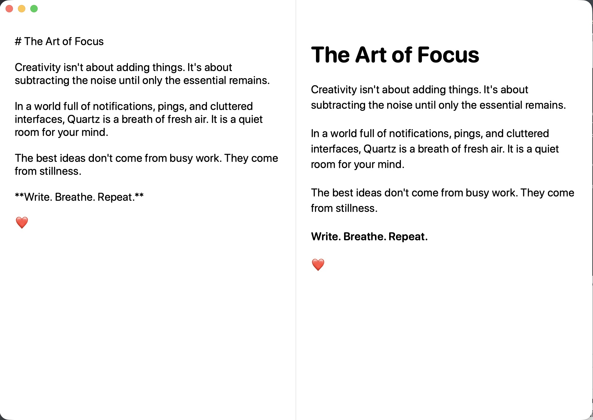
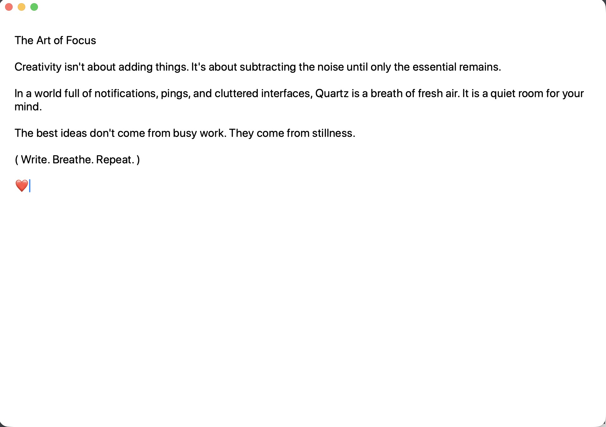
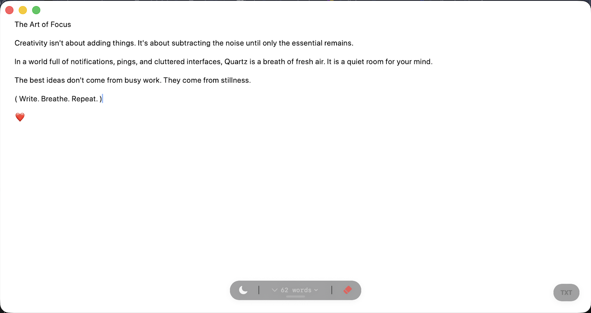

<p align="center">
  
</p>

<h1 align="center">Quartz</h1>
<p align="center"><strong>Write. Breathe. Repeat.</strong></p>
<p align="center">Un peu de calme pour vos idées. Un espace d’écriture natif pour votre Mac.</p>

<p align="center">
  <a href="README.md">English</a> · <strong>Français</strong>
</p>

<p align="center">
  <a href="https://github.com/rjn28/Quartz/releases/latest"></a>
  <a href="#documentation"></a>
  <a href="ROADMAP.md"></a>
</p>

<p align="center">
  
  <a href="https://github.com/rjn28/Quartz/actions/workflows/ci.yml"></a>
  <a href="https://github.com/rjn28/Quartz/actions/workflows/codeql.yml"></a>
  <a href="LICENSE"></a>
</p>

---

## The Art of Focus

> Creativity isn't about adding things. It's about subtracting the noise until only the essential remains.

Quartz laisse vos idées respirer. Écrivez une note, regardez votre Markdown prendre forme ou ouvrez le canevas pour esquisser une idée. Votre travail reste sur votre Mac, sans compte, synchronisation cloud, analyse d’usage ni connexion obligatoire.

<p align="center">
  <picture>
    <source media="(prefers-color-scheme: dark)" srcset="docs/screenshots/markdown-dark.jpg">
    <source media="(prefers-color-scheme: light)" srcset="docs/screenshots/markdown-light.jpg">
    
  </picture>
  <br>
  <sub>Écrivez à gauche. Voyez le résultat à droite. La vue Markdown divisée, en clair ou en sombre.</sub>
</p>

## De la place pour chaque idée

| | À votre rythme |
| :--- | :--- |
| **✍️ Gardez le fil** | Un éditeur épuré dont les commandes s’effacent pendant la saisie. Adaptez la taille du texte et choisissez l’apparence claire ou sombre. |
| **◧ Voyez vos mots prendre forme** | Aperçu Markdown, mode éditeur seul et vue divisée redimensionnable. |
| **✏️ Pensez au-delà du texte** | Un canevas par note, avec lignes, cercles, carrés, rectangles, texte, couleurs, annulation et rétablissement. |
| **▤ Retrouvez vos idées** | Historique des notes enregistrées et fenêtres macOS indépendantes, avec des réglages mémorisés par note. |
| **↗ Emportez vos mots** | Export du texte en TXT ou PDF paginé, par clic ou glisser-déposer, selon le mode de l’éditeur. |
| **⌘ Prenez vos habitudes** | Raccourcis clavier, libellés VoiceOver et statistiques de mots, caractères, lignes et temps de lecture. |

### Votre espace, clair ou sombre

<p align="center">
  <picture>
    <source media="(prefers-color-scheme: dark)" srcset="docs/screenshots/editor-dark.jpg">
    <source media="(prefers-color-scheme: light)" srcset="docs/screenshots/editor-light.jpg">
    
  </picture>
  <br>
  <sub>Le même espace paisible, en clair ou en sombre. Captures réalisées manuellement dans Quartz.</sub>
</p>

<details>
<summary><strong>L’inspiration originale</strong></summary>

La capture d’origine et son texte font toujours partie de l’histoire de Quartz.

> The best ideas don't come from busy work. They come from stillness.



</details>

## Installer Quartz

**macOS 14 Sonoma ou ultérieur · Apple Silicon (puces M).** Les Mac Intel ne sont pas pris en charge.

1. Téléchargez le `.dmg` de la [dernière version](https://github.com/rjn28/Quartz/releases/latest).
2. Ouvrez l’image disque et glissez **Quartz** dans **Applications**.
3. Lancez Quartz et commencez à écrire.

**La [v1.3.0](https://github.com/rjn28/Quartz/releases/tag/v1.3.0) est disponible :** signée Developer ID, notarisée par Apple et accompagnée d’une somme de contrôle SHA-256 et d’une attestation de provenance GitHub. L’installation et le lancement de cette version publique ont été confirmés sur le Mac du mainteneur ; les autres vérifications manuelles figurent dans le [suivi des tests](docs/TEST_TRACKER.md).

<details>
<summary><strong>Vérifier le téléchargement</strong></summary>

Téléchargez `Quartz-1.3.0.dmg` et `Quartz-1.3.0.dmg.sha256` depuis la [même release](https://github.com/rjn28/Quartz/releases/tag/v1.3.0). Dans le dossier contenant les deux fichiers, exécutez :

```bash
shasum -a 256 -c Quartz-1.3.0.dmg.sha256
gh attestation verify Quartz-1.3.0.dmg --repo rjn28/Quartz
```

La seconde commande nécessite la CLI GitHub. Pour une autre version, utilisez les noms de fichiers correspondants. Les versions antérieures à `v1.3.0` sont d’anciens builds signés ad hoc et non notarisés.

</details>

## Les nouveautés

La **version 1.3.0** apporte une base modernisée en Swift 6, une vue divisée redimensionnable, le rétablissement des dessins, des raccourcis clavier, des libellés VoiceOver, ainsi qu’une sauvegarde des notes et des exports PDF paginés plus fiables. Quartz est désormais sous licence **Apache-2.0**.

Depuis cette sortie, le projet a documenté les vérifications de la version publique, préparé un plan de distribution distinct sur le Mac App Store et actualisé l’automatisation CodeQL. **La disponibilité sur le Mac App Store et les mises à jour automatiques restent prévues pour la suite.**

[Historique complet](CHANGELOG.md) · [La suite](ROADMAP.md) · [Plan Mac App Store](docs/MAC_APP_STORE.md)

## À portée de clavier

| Raccourci | Action |
| :--- | :--- |
| `⌘ N` | Nouvelle fenêtre de note |
| `⌘ 0` | Afficher les commandes |
| `⌘ 1` / `⌘ 2` / `⌘ 3` | Éditeur / aperçu / vue divisée |
| `⌘ ⇧ D` | Ouvrir ou fermer le canevas |
| `⌘ Z` / `⌘ ⇧ Z` | Annuler / rétablir dans le canevas |

Retrouvez vos notes dans **Notes → Saved Notes**. En mode éditeur, le bouton d’export produit un fichier **TXT** ; en mode aperçu ou vue divisée, il produit un **PDF**. Cliquez pour enregistrer sur le Bureau, ou glissez le bouton vers une destination.

## Vos notes restent chez vous

Quartz conserve les métadonnées, le texte et les dessins dans les préférences locales de l’utilisateur macOS (`UserDefaults`, domaine `com.rjn28.Quartz`). Les exports sont créés à la demande. Quartz n’envoie pas votre contenu à un serveur.

Le stockage local n’est ni un coffre-fort chiffré ni un service de sauvegarde. Avant de tester une migration ou une version non publiée avec des notes importantes, sauvegardez les préférences de l’application. Le stockage indépendant et atomique des notes figure dans la [feuille de route](ROADMAP.md).

## Compiler depuis les sources

Utilisez un Mac Apple Silicon avec **macOS 14+** et les **Xcode Command Line Tools incluant Swift 6**. Quartz utilise Swift Package Manager et ne dépend d’aucun paquet tiers.

```bash
git clone https://github.com/rjn28/Quartz.git
cd Quartz
./scripts/build_and_run.sh --verify
```

Le script compile Quartz, prépare un bundle `.app` local dans `dist/`, le lance et vérifie que son processus fonctionne.

| Commande | Rôle |
| :--- | :--- |
| `./scripts/check.sh` | Compilation avec contrôle strict de la concurrence et avertissements traités comme erreurs, tests, build de release et vérification des diffs |
| `swift test` | Exécuter les tests automatisés |
| `./scripts/package_app.sh` | Créer un DMG local Apple Silicon dans `BuildArtifacts/` |

Sans `CODE_SIGN_IDENTITY`, le packaging local utilise une signature ad hoc réservée aux tests. Consultez le [guide de release](docs/RELEASING.md) pour la distribution publique, la signature et la notarisation.

## Documentation

| Découvrir | Développer et contribuer | État du projet |
| :--- | :--- | :--- |
| [Historique des changements](CHANGELOG.md) | [Architecture](docs/ARCHITECTURE.md) | [Audit et suivi des améliorations](docs/PROJECT_AUDIT.md) |
| [Feuille de route](ROADMAP.md) | [Contribution](CONTRIBUTING.md) | [Tests manuels et acceptation de release](docs/TEST_TRACKER.md) |
| [Assistance](SUPPORT.md) | [Processus de release](docs/RELEASING.md) | [Politique de sécurité](SECURITY.md) |
| [Plan Mac App Store](docs/MAC_APP_STORE.md) | [Code de conduite](CODE_OF_CONDUCT.md) | [Maintenance](MAINTAINERS.md) |

Les rapports de bugs et pull requests ciblées sont les bienvenus. [Signalez un bug ou proposez une idée](https://github.com/rjn28/Quartz/issues/new/choose), et lisez le [guide de contribution](CONTRIBUTING.md) avant de commencer. Signalez les vulnérabilités en privé selon la [politique de sécurité](SECURITY.md).

---

<p align="center">
  Open source sous <a href="LICENSE">licence Apache 2.0</a> · Créé par <a href="https://github.com/rjn28">Roch Junior Nicolas</a><br>
  <sub>Write. Breathe. Repeat.</sub>
</p>
