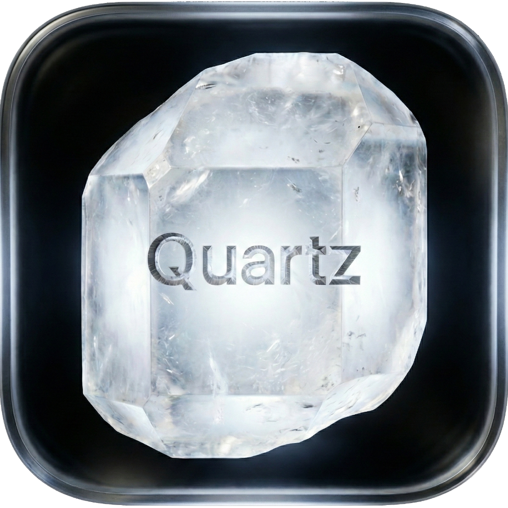
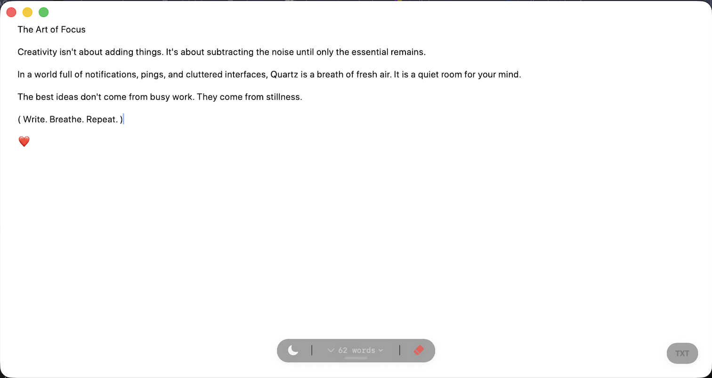

<div align="center">
  

  # 💎 Quartz
  **The purest thinking space for macOS.**

  <p>
    <a href="https://github.com/rjn28/Quartz/releases/latest">
      
    </a>
    
    
    <a href="https://www.linkedin.com/in/roch-junior-nicolas-le-dev/">
  
</a>
  </p>

  <p>
    <i>No folders. No cloud. Just you and your thoughts.</i>
  </p>
</div>

---

## Overview

Quartz is a native macOS application designed to eliminate friction between your brain and the screen. It acts as an ephemeral whiteboard—always ready, beautifully simple.

### Key Features
* **🎨 Glassmorphism UI:** A modern, translucent interface that blends into your macOS Sonoma/Sequoia desktop.
* **🧘 Zen Mode:** The interface fades away while you type. Focus entirely on your words.
* **🚀 Magic Drag Export:** Finished writing? Simply drag the `TXT` floating button onto your desktop or into an email to instantly create a file.
* **📊 Smart Stats:** Click the counter to toggle between Word Count, Character Count, and Reading Time.
* **⚡️ Native Performance:** Built with Swift 5.9 and SwiftUI.

---

## 📸 Screenshot

<div align="center">
  
</div>

---

## 📦 Installation

Quartz is an **Open Source** project distributed outside the Mac App Store.
Because I use a Free Apple Developer Account, the app is signed Ad-Hoc but **not notarized**.

**macOS will likely flag it for security. This is normal.**

### How to install:

1.  Download the latest **`.dmg`** file from the [Releases Page](https://github.com/rjn28/Quartz/releases/latest).
2.  Drag **Quartz** into your `Applications` folder.
3.  Launch the app.

### ⚠️ How to bypass the Security Warning

If you see a message saying *"Quartz cannot be opened because the developer cannot be verified"* or *"Quartz is damaged"*:

**Method 1 (Quickest):**
1.  **Right-Click** (or Control+Click) on the app icon.
2.  Select **Open**.
3.  Click **Open** in the dialog box.

**Method 2 (System Settings - Recommended):**
If Method 1 does not work:
1.  Click **Done** or **OK** on the error message.
2.  Open **System Settings**.
3.  Go to **Privacy & Security**.
4.  Scroll down to the **Security** section.
5.  You will see a message: *"Quartz was blocked from use..."*. Click **Open Anyway**.
6.  Enter your password/TouchID to confirm.

---

## 🛠 Building from Source

This project uses a custom Bash script to handle asset compilation and packaging (no `.xcodeproj` required).

**Prerequisites:**
* macOS 14.0 (Sonoma) or later.
* Swift 5.9+ installed via Command Line Tools.

**Build Instructions:**

1.  Clone the repository:
    ```bash
    git clone [https://github.com/rjn28/Quartz.git](https://github.com/rjn28/Quartz.git)
    cd Quartz
    ```

2.  Run the custom build script:
    ```bash
    chmod +x bundle_app.sh
    ./bundle_app.sh
    ```

3.  The script will compile the app, inject the icon manually, sign it locally, and generate a `Quartz_Installer.dmg`.

---

## 👨‍💻 Tech Stack

* **Language:** Swift 5
* **Framework:** SwiftUI
* **Architecture:** MVVM
* **System Integration:** `NSItemProvider`, `FileManager`.

---

<div align="center">
  Made with ❤️ by <a href="https://github.com/rjn28">Roch Junior NICOLAS</a>.
  <a href="https://www.linkedin.com/in/roch-junior-nicolas-le-dev/">Connect on LinkedIn 👔</a>
</div>