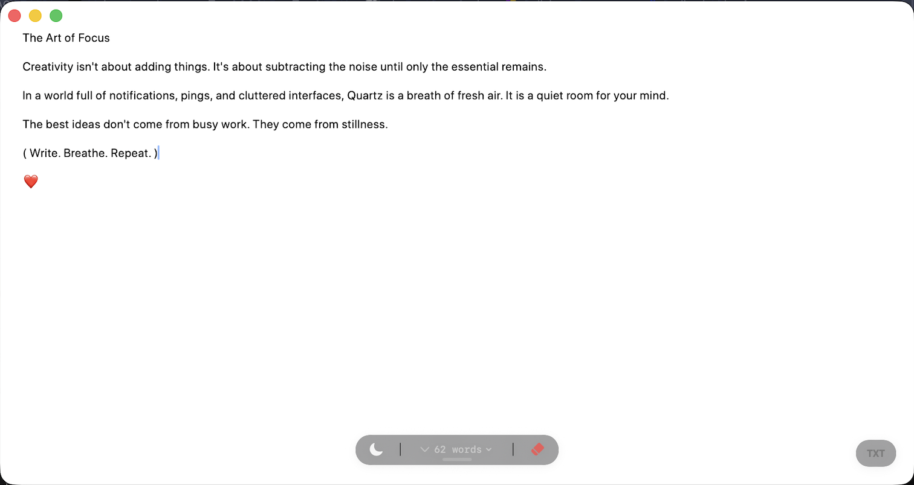

<div align="center">
  

  # Quartz

  **A private, local-first writing canvas for macOS.**

  [](https://github.com/rjn28/Quartz/actions/workflows/ci.yml)
  [](https://github.com/rjn28/Quartz/actions/workflows/codeql.yml)
  
  
  
</div>

Quartz is a native SwiftUI note editor designed to keep writing fast and distraction-free. Notes and drawings stay on the Mac in local user preferences; Quartz has no account, cloud sync, analytics, or network dependency.

## Features

- Focused text editor with controls that recede while you type.
- Markdown preview and a resizable editor/preview split view.
- Per-note drawing canvas with shapes, text, colors, undo, and redo.
- Persistent saved-note history and independent macOS windows.
- Word, character, line, and reading-time statistics.
- Light and dark appearances, configurable type size, keyboard commands, and VoiceOver labels.
- Click or drag exports in TXT and paginated PDF formats.

## Screenshot

<div align="center">
  
</div>

## Requirements

- macOS 14 Sonoma or later.
- Xcode Command Line Tools with Swift 6 for development.
- Apple Silicon and Intel are supported by the universal packaging workflow.

## Install

Published builds are available on the [Releases page](https://github.com/rjn28/Quartz/releases). Releases before `v1.3.0` are legacy arm64, ad hoc-signed builds that were not notarized; verify their provenance before running them. The new release workflow refuses to publish unless the app is Developer ID-signed, notarized, stapled, checksummed, and attested.

Until a notarized `v1.3.0` or newer release is available, building from source is the recommended path.

For future trusted releases, download the `.dmg` and matching `.sha256`, then verify both checksum and GitHub provenance before opening the installer:

```bash
shasum -a 256 -c Quartz-X.Y.Z.dmg.sha256
gh attestation verify Quartz-X.Y.Z.dmg --repo rjn28/Quartz
```

## Build from source

```bash
git clone https://github.com/rjn28/Quartz.git
cd Quartz
swift build
swift run QuartzApp
```

Run the complete local validation suite:

```bash
./scripts/check.sh
```

Create a universal local DMG:

```bash
./bundle_app.sh
```

The DMG is written to `BuildArtifacts/`. Without `CODE_SIGN_IDENTITY`, local packaging uses an ad hoc signature for testing only and is not suitable for public distribution. See [the release guide](docs/RELEASING.md) for Developer ID signing and notarization.

## Data and privacy

Quartz stores note metadata, text, and encoded canvas data in the current macOS user's `UserDefaults` domain for `com.rjn28.Quartz`. Exports are created only when requested. No content leaves the Mac through Quartz.

Before testing migrations or unreleased builds with important notes, back up the app's preferences. The project health report tracks the planned move toward independently stored, atomic note records.

## Project documentation

- [Architecture](docs/ARCHITECTURE.md)
- [Project audit and improvement tracker](docs/PROJECT_AUDIT.md)
- [Roadmap](ROADMAP.md)
- [Changelog](CHANGELOG.md)
- [Release process](docs/RELEASING.md)
- [Contributing](CONTRIBUTING.md)
- [Security policy](SECURITY.md)

## Contributing

Bug reports and focused pull requests are welcome. Read [CONTRIBUTING.md](CONTRIBUTING.md) before starting, and report security issues privately as described in [SECURITY.md](SECURITY.md).

## License

Quartz is currently **source-available**, not OSI open source: the custom [LICENSE](LICENSE) permits non-commercial use and modification while prohibiting commercial use and app-store distribution. The long-term license remains an explicit maintainer decision tracked in the [project audit](docs/PROJECT_AUDIT.md).

Maintained by [Roch Junior Nicolas](https://github.com/rjn28).
